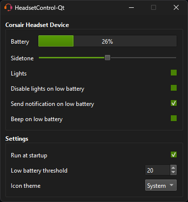

# HeadsetControl-Qt

Qt Gui for headsetcontrol.  
Features a tray icon with battery status in tooltip.

## Supported devices

Supported devices list can be found [here](https://github.com/Sapd/HeadsetControl?tab=readme-ov-file#supported-headsets).  
If a particular setting is greyed out on the settings page, it indicates that your device does not support it.

## Download

Precompiled windows binaries can be found in [release](https://odizinne.net/Odizinne/HeadsetControl-Qt/releases/latest) section

## To-do
- Add other headsetcontrol supported settings (My headset does not support them so i cannot test)
- Bring back linux support
